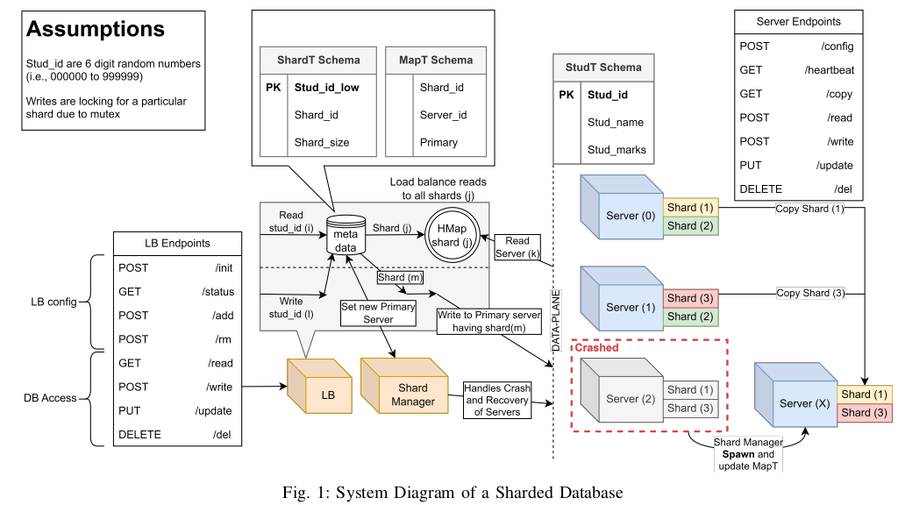

# Distributed Systems Assignment 3:<br>Implementing Write-Ahead Logging for Consistency in Replicated Database with Sharding
 ## Overview

This assignment involves implementing a sharded database that stores a single table (StudT) across multiple shards distributed across several server containers. Each shard can be replicated across multiple server containers to enable parallel read capabilities. The focus of this assignment is to implement a Write-Ahead Logging (WAL) mechanism for maintaining consistency among the replicas of the shards distributed among various servers.
<!-- 
 -->
 <p align="center">
  
</p>

 ## System Requirements
 - OS: Ubuntu 20.04 LTS or above
 - Docker: Version 20.10.23 or above

## Server

- The server containers handle 2 different shards (one replica each) 
- This has the following endpoints:
    - `Endpoint (/config, method=POST)`
    This endpoint initializes the shard tables in the server database after the container is loaded. The shards are configured according to the request payload.
      ```json
          REQUEST PAYLOAD
            {
              "schema": {
                  "columns": ["Stud_id", "Stud_name", "Stud_marks"],
                  "dtypes": ["Number", "String", "String"]
              },
              "shards": ["sh1", "sh2"]
          }


          RESPONSE PAYLOAD
              {
              "message": "Server0:sh1, Server0:sh2 configured",
              "status": "success"
          }

      ```
    - `Endpoint (/heartbeat, method=GET)`
    This endpoint sends heartbeat responses upon request. The heartbeat endpoint is further used to identify failures in the set of server containers maintained in the distributed database.
      ```json
          Response: [EMPTY]
          Response Code: 200
      ```
    - `Endpoint (/copy, method=GET)`
    This endpoint returns all data entries corresponding to one shard table in the server container. Copy endpoint is further used to populate shard tables from replicas in case a particular server container fails.
      ```json
          REQUEST PAYLOAD
            {
                "shards": ["sh1", "sh2"]
            }


          RESPONSE PAYLOAD
              {
            "sh1": [
                {"Stud_id": 1232, "Stud_name": "ABC", "Stud_marks": 25},
                {"Stud_id": 1234, "Stud_name": "DEF", "Stud_marks": 28},
                ...
            ],
            "sh2": [
                {"Stud_id": 2255, "Stud_name": "GHI", "Stud_marks": 27},
                {"Stud_id": 2535, "Stud_name": "JKL", "Stud_marks": 23},
                ...
            ],
            "status": "success"
        }

      ```
    - `Endpoint (/read, method=POST)`
    This endpoint reads data entries from a shard in a particular server container. The
endpoint expects a range of Stud ids (low, high) and Shard id that has to be read from the server container.
      ```json
          REQUEST PAYLOAD
           {
              "shard": "sh2",
              "Stud_id": {"low": 2235, "high": 2555}
          }


          RESPONSE PAYLOAD
              {
              "data": [
                  {"Stud_id": 2535, "Stud_name": "JKL", "Stud_marks": 23},
                  {"Stud_id": 2536, "Stud_name": "MNO", "Stud_marks": 22}
                  ...
              ],
              "status": "success"
          }
      ```
    - `Endpoint (/write, method=POST)`
      For secondary servers, this endpoint makes changes in the log and then writes data
entries in a shard in a particular server container and for Primary server it first makes changes to its log, then send
write request to other servers where same shard is present, once it gets confirmation from other secondary servers then
it writes the data in its database. The endpoint expects multiple entries to be written in the server container along with
Shard id and the current index for the shard.
      ```json
      REQUEST PAYLOAD
        {
            "shard": "sh2",
            "data": [
                {"Stud_id": 2255, "Stud_name": "GHI", "Stud_marks": 27},
                {"Stud_id": ..., "Stud_name": ..., "Stud_marks": ...},
                ...
            ]
        }
      RESPONSE PAYLOAD
          {
          "message": "Data entries added",
          "status": "success"
      }
      ```
    - `Endpoint (/update, method=POST)`
    This endpoint updates a particular data entry in a shard in a particular server container. The endpoint expects only one entry to be updated in the server container along with Shard id.
      ```json
        REQUEST PAYLOAD
          {
          "shard": "sh2",
          "Stud_id": 2255,
          "data": {"Stud_id": 2255, "Stud_name": "GHI", "Stud_marks": 28}
         }

        RESPONSE PAYLOAD
            {
              "message": "Data entry for Stud_id:2255 updated",
              "status": "success"
          }

        ```

    - `Endpoint (/del, method=DELETE)`
    This endpoint deletes a particular data entry (based on Stud id) in a shard in a particular server container. The endpoint expects only one entry to be deleted in the server container along with Shard id.
      ```json
          REQUEST PAYLOAD
            {
              "shard": "sh1",
              "Stud_id": 2255
           }


          RESPONSE PAYLOAD
              {
              "shard": "sh1",
              "Stud_id": 2255
          }

      ```

## Loadbalancer

- The loadbalancer stores the information regarding each shard
- The mapping of replica of shard to server
- This has the following endpoints:
    - `Endpoint (/init, method=POST)`
    This endpoint initializes the distributed database across different shards and replicas in the server containers. Administrators should provide the configuration of shards and their placements in the set of server containers.
      ```json
          REQUEST PAYLOAD
          {
              "N": 3,
              "schema": {
                  "columns": ["Stud_id", "Stud_name", "Stud_marks"],
                  "dtypes": ["Number", "String", "String"]
              },
              "shards": [
            {"Stud_id_low": 0, "Shard_id": "sh1", "Shard_size": 4096},
           {"Stud_id_low": 4096, "Shard_id": "sh2", "Shard_size": 4096},
            {"Stud_id_low": 8192, "Shard_id": "sh3", "Shard_size": 4096}
              ],
              "servers": {
                  "Server0": ["sh1", "sh2"],
                  "Server1": ["sh2", "sh3"],
                  "Server2": ["sh1", "sh3"]
                        }
          }


          RESPONSE PAYLOAD
              {
                  "message": "Configured Database",
                  "status": "success"
              }


      ```
    - `Endpoint (/status, method=GET)`
    This endpoint sends the database configurations upon request. The configuration is set via the /init endpoint.
      ```json
          REQUEST PAYLOAD [EMPTY]

          RESPONSE PAYLOAD
          {
              "N": 3,
              "schema":
                   {
                      "columns": ["Stud_id", "Stud_name", "Stud_marks"],
                      "dtypes": ["Number", "String", "String"]
                   },
              "shards": [
                {"Stud_id_low": 0,"Shard_id": "sh1","Shard_size": 4096},
                {"Stud_id_low": 4096,"Shard_id": "sh2","Shard_size": 4096},
                {"Stud_id_low": 8192,"Shard_id": "sh3","Shard_size": 4096}
                  ],
                  "servers": {
                      "Server0": ["sh1", "sh2"],
                      "Server1": ["sh2", "sh3"],
                      "Server2": ["sh1", "sh3"]
                  }
              }


      ```
    - `Endpoint (/add, method=POST)`
    This endpoint adds new server instances in the load balancer to scale up with increasing client numbers in the system.
      ```json
          REQUEST PAYLOAD
          {
              "n": 2,
              "new_shards": [
              {"Stud_id_low": 12288, "Shard_id": "sh5", "Shard_size": 4096}
              ],
              "servers": {
                  "Server4": ["sh3", "sh5"],
                  "Server5": ["sh2", "sh5"]
              }
          }


          RESPONSE PAYLOAD
          {
              "N": 5,
              "message": "Add Server:4 and Server:5",
              "status": "successful"
          }
        


      ```
    - `Endpoint (/rm, method=POST)`
    This endpoint removes server instances in the load balancer to scale down with decreasing client or system maintenance. The endpoint expects a JSON payload that mentions the number of instances to be removed and their preferred server names in a list. 
      ```json
          REQUEST PAYLOAD
            {
              "n": 2,
              "servers": ["Server4"]
          }

          RESPONSE PAYLOAD
            {
              "message": {
                  "N": 3,
                  "servers": ["Server1", "Server4"] 
              },
              "status": "successful"
          }

      ```
    - `Endpoint (/read, method=GET)`
Based on the consistent hashing algorithm, this endpoint reads data entries from the
shard replicas across all server containers. The endpoint expects a range of Stud ids (low, high) to be read from the
distributed database
      ```json
          REQUEST PAYLOAD
            {
                "Stud_id": {"low": 1000, "high": 8889}
            }


          RESPONSE PAYLOAD
            {
              "shards_queried": ["sh1", "sh2", "sh3"],
              "data": [
                  {"Stud_id": 1000, "Stud_name": "PQR", "Stud_marks": 23},
                  {"Stud_id": 1001, "Stud_name": "STV", "Stud_marks": 22},
                  ...
              ],
              "status": "success"
          }


      ```

    - `Endpoint (/write, method=POST)`
    This endpoint writes data entries in the distributed database.
      ```json
          REQUEST PAYLOAD
         {
          "data": [
              {"Stud_id": 2255, "Stud_name": "GHI", "Stud_marks": 27},
              {"Stud_id": 3524, "Stud_name": "JKBFSFS", "Stud_marks": 56},
              ...
          ]
         }

          RESPONSE PAYLOAD
           {
              "message": "Data entries added",
              "status": "success"
          }


      ``` 
    - `Endpoint (/update, method=PUT)`
    This endpoint updates a particular data entry in the distributed database.
      ```json
          REQUEST PAYLOAD
          {
            "Stud_id": 2255,
            "data": {"Stud_id": 2255, "Stud_name": "GHI", "Stud_marks": 30}
           }

          RESPONSE PAYLOAD
            {
              "message": "Data entry for Stud_id:2255 updated",
              "status": "success"
          }
  


      ``` 
    - `Endpoint (/del, method=DELETE)`
    This endpoint deletes a particular data entry (based on Stud id) from the distributed database.
      ```json
            REQUEST PAYLOAD
                {
                    "Stud_id": 2255
                }

            RESPONSE PAYLOAD
              {
                  "message": "Data entry with Stud_id:2255 removed",
                  "status": "success"
              }

        ``` 

- If any server is down the loadbalancer spawns another server
## MetaDB
- MetaDB is a container dedicated to hosting the metadata database, which stores essential information about shards and servers in the distributed system. 
- The database manages two tables ShardT and MapT.
    ### ShardT:

    | Field       | Description                                                   |
    |-------------|---------------------------------------------------------------|
    | Stud id low | The lower bound of Student IDs range assigned to the shard.   |
    | Shard id    | The unique identifier for the shard.                          |
    | Shard size  | The maximum number of Student IDs allocated to the shard.     |

    ## MapT Table Schema

    The `MapT` table is used to store mappings between shards and servers in the distributed database system. Below is the schema for the `MapT` table:

    | Field     | Type    | Description                                      |
    |-----------|---------|--------------------------------------------------|
    | Shard id  | Number  | The identifier of the shard                      |
    | Server id | Number  | The identifier of the server hosting the shard   |
    | Primary   | Boolean | Indicates whether the server is the primary one  |

## Shard Manager

## Client

- Client sends the requests to the loadbalancer.
- Client recieves response from the server via loadbalancer.

## Run Locally
Ensure docker, docker-compose and jupyter-notebook are installed.

Clone the project

```bash
  git clone git@github.com:bhanuteja1489/DS-ASSGN3.git
```

Go to the project directory

```bash
  cd DS-ASSGN3
```

Install dependencies (For Analysis part)  


```bash
  pip3 install requests, aiohttp, matplotlib, 
```

Build docker images for Loadbalancer and Server

```bash
  sudo make build
```
Start the containers 

```bash
  sudo make 
```
Now run the code from **analysis.ipynb**z (covers task A1, A2, A3) and **analysis-task-A4.ipynb** (covers task A4)

Remove all containers

```bash
  sudo make clean
```

To view the tables MapT and ShardT in metadb run the below command
```bash
  sudo make view_metadb
```

## Analysis

1. In the default configuration, time taken for 10,000 write requests is `559.99 seconds` and time taken for 10,000 read requests is `75.85 seconds`.

2. After increasing the number of shard replicas to 7, the time taken for 10,000 write requests is `397.35 seconds` and time taken for 10,000 read requests is `55.96 seconds`.

3. After increasing the number of servers to 10 and increasing the number of shards to 6 and replicas to 8, the time taken for 10,000 write requests is `1768 seconds` and time taken for 10,000 read requests is `61.14 seconds`

4. All the endpoints are tested and everything is working perfectly fine. After dropping a server container the load balancer is successfully spawns a new container and copies the shard entries present in other replicas.


# Design Choice

We used Passive Replication

One primary is selected and it sends all write requests to other servers
Secondary servers updates their data once they get request from primary and send an ack to the primary
Once primary gets enough votes it updates data locally and commits the data
If secondary crashes then the shard manager respawns a new server. It gets the data from the primary.
If primary crashes then shard manager along with respawning new server, starts leader election. It gets the data from the newly elected leader. 

### Leader Election
All the servers send their latest commit log index to the shard manager. 
Shard manager selects one with highest commit index or any one of the server if there are multiple servers with same log maximum commited log index.
